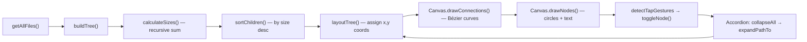

<div align="center">
  
  <h1>StoragePilot 🚀</h1>
  <p><strong>A Next-Generation Android Storage Intelligence Platform</strong></p>
  <p>
    
    
    
    
    
  </p>
</div>

---

StoragePilot is a professional-grade Android application that gives users **complete visibility and control** over their device's storage. Built entirely with **Jetpack Compose** and **Clean Architecture**, it goes far beyond a simple file manager — offering an interactive 2D visual file map, Tinder-style swipe-to-delete cleanup, intelligent duplicate detection via MD5 hashing, and a safe recycle bin with auto-expiry. **Zero cloud. Zero tracking. 100% local.**

---

## 📥 Download

**[⬇ Download StoragePilot APK (Latest Release)](https://github.com/Abhinav-2312307/StoragePilot/raw/main/apk/StoragePilot.apk)**

> Minimum: Android 8.0 (API 26) • Target: Android 14 (API 34)

---

## 📸 Feature Overview

### 1. 🏠 Smart Dashboard
The home screen provides an at-a-glance overview of your device's entire storage.

- **Animated Ring Chart** — Real-time donut visualization with color-coded segments for Images, Videos, Audio, Documents, Apps, Archives, Downloads, System OS, and more.
- **Dynamic Category Grid** — Tap any category card (Images, Videos, APKs, etc.) to dive directly into the file explorer filtered to that type.
- **Quick Actions Panel** — One-tap access to Find Duplicates, Large Files, Hidden Storage, App Analyzer, and Recycle Bin.
- **Deep Scan Engine** — Triggers a multi-phase scan (MediaStore → FileSystem → MD5 Hashing) that indexes every file on your device and persists results in a local Room database.
- **System OS Calculation** — Intelligently computes the OS/system partition size by subtracting all indexed user data from total used space reported by `StatFs`.

---

### 2. 📂 File Explorer
A full-featured file browser with powerful sorting and filtering.

- **Category Filter Chips** — Instantly filter by Images, Videos, Audio, Documents, Apps, Archives, Downloads, Cache, Hidden, and more.
- **Multi-Sort Options** — Sort by Largest/Smallest First, Newest/Oldest, or Name (A-Z).
- **File Viewer** — Tap any file to open it with the system's default handler via `FileProvider` intents.

---

### 3. 🔥 Swipe Cleanup (Tinder-Style File Review)
The flagship cleanup experience — review files one at a time with swipe gestures.

- **Swipe Left** → Mark for deletion (red overlay, trash icon)
- **Swipe Right** → Keep (green overlay, heart icon)
- **Skip / Undo** — Skip files or undo the last delete action.
- **Two Grouping Modes** — Browse files by **Album** (parent folder) or by **Month** (modification date).
- **Random 30** — Shuffle and review 30 random files for a quick declutter session.
- **Category Filters** — Filter the swipe session to only Images, Videos, Documents, Apps, or Archives.
- **Sort Toggle** — Switch between sorting by Date (newest first) or Size (largest first).
- **Gallery Timeline** — A scrollable thumbnail strip at the bottom shows your progress with green (kept) and red (deleted) indicators.
- **Batch Commit** — Files are not deleted instantly. They are batched and committed to the Recycle Bin in a single safe operation when you press "Delete (N)".
- **Full-Screen Dialog** — The swiping session opens as an immersive full-screen overlay with `BackHandler` support.

---

### 4. 📊 Storage Analytics
Deep analytics and lifetime statistics.

- **Storage Ring Chart with Legend** — Identical to the dashboard chart, but with a full color-coded legend showing exact byte counts per category.
- **Cleanup History** — Lifetime stats showing total bytes freed and total files cleaned across all sessions.
- **Category Bar Chart** — Horizontal animated progress bars for each file category, sorted by size, with color-coded gradients.
- **Interactive System Flowchart CTA** — A premium card that launches the 2D storage map (see below).

---

### 5. 🗺️ Interactive 2D System Flowchart
A custom-built Canvas engine that renders your entire storage hierarchy as a zoomable, pannable, interactive node graph.

- **Recursive Tree Building** — Every file on your device is organized into a tree structure rooted at `/storage/emulated/0`.
- **Logarithmic Node Sizing** — Folder sizes determine circle radius using `log10(sizeBytes) * 10`, clamped to `[15px, 120px]`. Massive folders (like DCIM) visually dwarf smaller ones.
- **Size Inside Nodes** — Each node circle displays the formatted file size (e.g., "4.2 GB") centered inside it, with the folder name rendered to the right.
- **Bézier Curve Connections** — Parent-child relationships are drawn using smooth cubic Bézier curves for a premium flow look.
- **Accordion Expansion** — Tapping a folder node expands it and collapses all other branches. This "accordion" behavior ensures only one path is rendered at a time, preventing the Canvas from crashing on 10,000+ files.
- **Pinch-to-Zoom & Pan** — Full gesture support using `detectTransformGestures` with scale clamped to `[0.1x, 5.0x]`.
- **Double-Tap to Open** — Double-tapping a folder node opens it in the native Android file manager. Double-tapping a file opens it with the system handler.
- **Crash-Safe Rendering** — All `drawText` calls are wrapped in `try-catch` blocks with pre-measured `TextLayoutResult` objects to prevent `IllegalArgumentException` during aggressive zoom/pan.

```
Internal Storage (Root)
├── DCIM/ ──────── [●4.2 GB] ─┬── Camera/ ──── [●3.8 GB]
│                              └── Screenshots/ [●400 MB]
├── WhatsApp/ ──── [●2.1 GB]
├── Download/ ──── [●1.5 GB]
├── Android/ ───── [●900 MB]
└── Documents/ ─── [●200 MB]
```

---

### 6. 🔍 Duplicate Detector
Finds true content duplicates using a multi-stage hashing pipeline.

- **Stage 1: Size Grouping** — Files with unique sizes are immediately filtered out.
- **Stage 2: Partial Hash** — For same-sized files, computes an MD5 hash of the first 8KB.
- **Stage 3: Full MD5 Hash** — For partial hash collisions, computes the complete file hash to confirm the duplicate.
- **Wasted Space Summary** — Shows total wasted bytes across all duplicate groups.
- **Safe Keep/Delete** — The first file in each group is protected as the "original". Only copies show the delete button.

---

### 7. 📦 Large File Finder
Surfaces storage-heavy files with configurable thresholds.

- **Threshold Filters** — Quick dropdown to filter by `> 10 MB`, `> 50 MB`, `> 100 MB`, `> 500 MB`, or `> 1 GB`.
- **Total Size Counter** — Aggregated size of all files matching the threshold.
- **Direct Delete** — Each file row has a one-tap delete button that safely routes through the Recycle Bin.

---

### 8. 👁️‍🗨️ Hidden Storage Scanner
Detects hidden files (dotfiles) and junk data that other cleaners miss.

- **Hidden File Detection** — Scans for files prefixed with `.` or stored in hidden directories.
- **Total Hidden Space** — Aggregate size of all hidden content.
- **Delete with Safety Net** — All deletions route through the Recycle Bin for safe recovery.

---

### 9. 📱 App Analyzer
A detailed breakdown of every installed application's storage footprint.

- **Per-App Storage Breakdown** — Shows APK size, User Data, and Cache for each app.
- **Usage Access Integration** — Prompts for `PACKAGE_USAGE_STATS` permission to unlock precise app data sizes.
- **Multi-Sort** — Sort by Largest, Smallest, Cache Size, or Name.
- **Bottom Sheet Detail View** — Tap any app to see a modal sheet with full size breakdown and action buttons.
- **Manage App** — Launches the native Android App Info screen for cache/data clearing.
- **Browse Internal Files** — Navigates to a dedicated screen showing files that belong to the selected app, scanned from public accessible storage.

---

### 10. ♻️ Recycle Bin
A safety net for all deletions throughout the app.

- **Safe Delete Flow** — All deletions across Swipe Cleanup, Large Files, Hidden Storage, and Duplicates route through the Recycle Bin. Files are physically moved to `.StoragePilot_Recycle/`.
- **Restore** — One-tap file restoration to the original path.
- **Auto-Expiry** — Files are automatically permanently deleted after a configurable period (default: 30 days). A countdown ("Xd left") is shown per file.
- **Empty Bin** — Confirmation dialog before permanently deleting all items.
- **Thumbnail Previews** — Images and videos show thumbnails loaded via Coil from the recycle path.

---

### 11. 🔎 Global Search
Instant search across all indexed files.

- **Real-Time Query** — Debounced text input searches file names and extensions.
- **Category Filter Chips** — Narrow search results by file type.
- **Auto-Focus** — The search field is automatically focused on screen entry.

---

### 12. ⚙️ Settings
Configurable preferences persisted via DataStore.

- **Show Hidden Files** — Toggle whether the scanner includes dotfiles.
- **Recycle Bin Auto-Delete** — Configure auto-delete period: 7, 14, 30, or 60 days.
- **Developer Portfolio Link** — Opens [abhinavsahu.me](https://abhinavsahu.me/) in the browser.
- **Privacy Policy** — States that StoragePilot works 100% offline with no data leaving the device.
- **Version** — v1.1.0

---

## 🏗️ Architecture

StoragePilot follows **Clean Architecture** with the MVVM presentation pattern, enforced through Dagger Hilt dependency injection.

```mermaid
graph TB
    subgraph Presentation["🖥️ Presentation Layer"]
        direction TB
        A1[DashboardScreen] --> A2[DashboardViewModel]
        B1[ExplorerScreen] --> B2[ExplorerViewModel]
        C1[SwipeCleanupScreen] --> C2[SwipeCleanupViewModel]
        D1[AnalyticsScreen] --> D2[AnalyticsViewModel]
        E1[SystemFlowchartScreen] --> E2[SystemFlowchartViewModel]
        F1[DuplicatesScreen] --> F2[DuplicatesViewModel]
        G1[LargeFilesScreen] --> G2[LargeFilesViewModel]
        H1[HiddenStorageScreen] --> H2[HiddenStorageViewModel]
        I1[AppAnalyzerScreen] --> I2[AppAnalyzerViewModel]
        J1[RecycleBinScreen] --> J2[RecycleBinViewModel]
        K1[SearchScreen] --> K2[SearchViewModel]
    end

    subgraph Domain["⚡ Domain Layer"]
        direction TB
        U1[ScanStorageUseCase]
        U2[GetStorageReportUseCase]
        U3[DeleteFilesUseCase]
        U4[DetectDuplicatesUseCase]
        U5[GetLargeFilesUseCase]
        U6[SearchFilesUseCase]
        U7[RestoreFilesUseCase]
        U8[AnalyzeAppsUseCase]
    end

    subgraph Data["💾 Data Layer"]
        direction TB
        R1[FileRepositoryImpl]
        R2[AppStorageRepositoryImpl]
        R3[RecycleBinRepositoryImpl]
        R4[CleanupStatsRepositoryImpl]
        S1[StorageScanner]
        S2[MediaStoreScanner]
        S3[FileSystemScanner]
        S4[DuplicateDetector]
        DB[(Room Database)]
        DS[(DataStore)]
    end

    A2 & B2 & C2 & D2 & E2 & F2 & G2 & H2 & I2 & J2 & K2 --> U1 & U2 & U3 & U4 & U5 & U6 & U7 & U8
    U1 & U2 & U3 & U4 & U5 & U6 & U7 & U8 --> R1 & R2 & R3 & R4
    R1 --> S1
    S1 --> S2 & S3 & S4
    R1 & R3 & R4 --> DB
    R2 --> DS
```



---

## 🔄 Scan Pipeline

The deep scan engine performs a **3-phase** pipeline to index every file on the device:

```mermaid
sequenceDiagram
    participant User
    participant Scanner as StorageScanner
    participant MS as MediaStoreScanner
    participant FS as FileSystemScanner
    participant DB as Room Database

    User->>Scanner: startFullScan()
    Scanner->>DB: Create ScanSession
    Scanner->>DB: Clear previous index

    rect rgb(40, 40, 80)
        Note over Scanner,MS: Phase 1 — MediaStore (Fast)
        Scanner->>MS: scanAllMedia()
        MS-->>Scanner: Batched FileIndexEntities
        Scanner->>DB: insertAll(batch)
    end

    rect rgb(40, 80, 40)
        Note over Scanner,FS: Phase 2 — FileSystem (Thorough)
        Scanner->>FS: scanDirectories(existingPaths)
        FS-->>Scanner: Non-indexed files
        Scanner->>DB: insertAll(batch)
    end

    rect rgb(80, 40, 40)
        Note over Scanner,DB: Phase 3 — Duplicate Detection
        Scanner->>DB: getDuplicateHashes()
        Scanner->>DB: markDuplicates(hashes)
    end

    Scanner->>DB: Finalize ScanSession
    Scanner-->>User: ScanProgress.Complete
```



---

## 🗺️ Flowchart Engine — How It Works

The interactive storage map uses a custom Canvas rendering pipeline:



| Property | Value |
|----------|-------|
| Node radius formula | `log₁₀(sizeBytes) × 10`, clamped `[15px, 120px]` |
| Horizontal spacing | `depth × 400px` |
| Vertical spacing | `radius × 2 + 40px` padding |
| Max children rendered | 100 per node |
| Zoom range | `0.1x` to `5.0x` |
| Expansion mode | Accordion (single-path) |

---

## 🛠️ Technology Stack

| Layer | Technology |
|-------|-----------|
| **Language** | Kotlin 2.0 |
| **UI Framework** | Jetpack Compose (100% declarative) |
| **Architecture** | Clean Architecture + MVVM |
| **DI** | Dagger Hilt |
| **Database** | Room (SQLite) |
| **Preferences** | Jetpack DataStore |
| **Async** | Kotlin Coroutines + StateFlow |
| **Image Loading** | Coil |
| **Navigation** | Type-Safe Navigation (Kotlin Serialization) |
| **Design System** | Custom AMOLED Dark Theme with Glassmorphism |

---

## 📁 Project Structure

```
app/src/main/java/com/storagepilot/app/
├── core/
│   ├── di/             # Hilt modules (DatabaseModule, RepositoryModule)
│   ├── theme/          # AMOLED color system, typography, shapes
│   ├── ui/components/  # GlassCard, StorageRingChart, AnimatedProgressBar, FileListItem
│   └── util/           # FileUtils, HashUtils, IntentUtils
├── data/
│   ├── local/          # Room Database, DAOs, Entities
│   ├── preferences/    # DataStore wrapper
│   ├── repository/     # Repository implementations
│   └── scanner/        # StorageScanner, MediaStoreScanner, FileSystemScanner, DuplicateDetector
├── domain/
│   ├── model/          # ScannedFile, DuplicateGroup, RecycleBinItem, AppInfo, ScanProgress
│   ├── repository/     # Repository interfaces
│   └── usecase/        # ScanStorage, DeleteFiles, DetectDuplicates, SearchFiles, etc.
├── feature/
│   ├── dashboard/      # Home screen with ring chart and quick actions
│   ├── explorer/       # File browser with sorting and category filtering
│   ├── swipecleanup/   # Tinder-style swipe-to-delete experience
│   ├── analytics/      # Charts, stats, and System Flowchart
│   ├── duplicates/     # MD5-based duplicate finder
│   ├── largefiles/     # Configurable large file detector
│   ├── hidden/         # Hidden/dotfile scanner
│   ├── appanalyzer/    # Per-app storage breakdown
│   ├── recyclebin/     # Safe delete with restore and auto-expiry
│   ├── search/         # Global file search
│   ├── scan/           # Scan progress screen
│   └── settings/       # Preferences
├── navigation/         # Type-safe routes, NavGraph, BottomNavItem
├── MainActivity.kt     # Permission handling and Compose entry point
└── StoragePilotApp.kt  # Hilt Application class
```

---

## 🔐 Permissions

| Permission | Purpose |
|-----------|---------|
| `READ_MEDIA_IMAGES/VIDEO/AUDIO` | Access media files (Android 13+) |
| `MANAGE_EXTERNAL_STORAGE` | Full filesystem scan access |
| `QUERY_ALL_PACKAGES` | List all installed applications |
| `PACKAGE_USAGE_STATS` | Read precise app data/cache sizes |
| `FOREGROUND_SERVICE` | Background scanning |
| `POST_NOTIFICATIONS` | Scan progress notifications |

---

## 🎨 Design System

StoragePilot uses a custom **AMOLED Dark** design system optimized for OLED displays:

- **Background**: Pure black (`#0A0A0F`) for true black pixels
- **Primary**: Electric Indigo (`#6C63FF`)
- **Secondary**: Cyan Neon (`#00D9FF`)
- **Tertiary**: Coral Pink (`#FF6B9D`)
- **Glassmorphism**: Semi-transparent white cards (`8% white`) with subtle borders (`12% white`)
- **Category Colors**: 10+ distinct colors for the ring chart and bar charts
- **Animations**: Spring-based swipe physics, animated progress bars, pulsing status dots

---

## 👨‍💻 Developed By

**Abhinav Sahu**  
Portfolio: [abhinavsahu.me](https://abhinavsahu.me/)

---

<div align="center">
  <p><em>If you like this project, please consider leaving a ⭐!</em></p>
</div>
