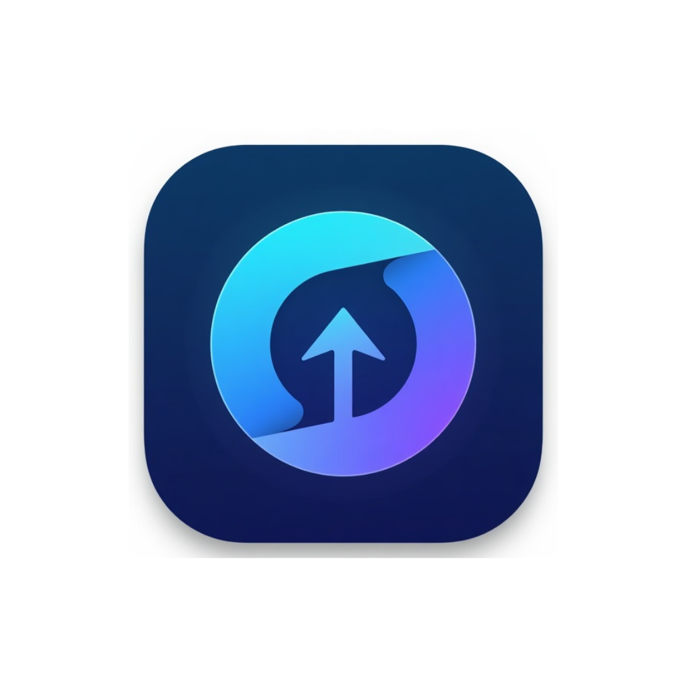
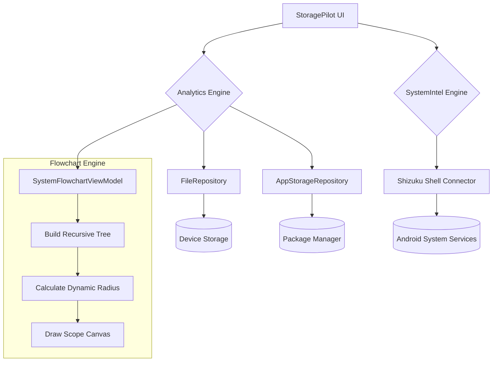

  
  <h1>StoragePilot 🚀</h1>
  
<strong>A Next-Generation Android Storage Diagnostics & Analytics Platform</strong>

StoragePilot is a professional-grade Android application designed to give users unprecedented insights into their device's storage and system performance. Built with modern Android architecture and Jetpack Compose, it completely bypasses traditional file explorer limitations, providing dynamic 2D visual maps, real-time analytics, and deep system intelligence.

---

## 📥 Download

**[Download the latest StoragePilot APK](https://github.com/Abhinav-2312307/StoragePilot/raw/main/apk/StoragePilot.apk)**

---

## ✨ Key Features

### 🗺️ Interactive 2D System Flowchart
- **Custom Canvas Engine:** A bespoke graphics engine built purely in Jetpack Compose Canvas.
- **Node-Link File Mapping:** Explore your entire file system as a zoomable, pannable mind-map.
- **Dynamic Sizing:** Folder sizes mathematically dictate node radius, making massive directories physically dwarf smaller ones.
- **Smart Rendering:** Accordion-style node expansion ensures minimal memory footprint even when mapping 10,000+ files.
- **Native Bridge:** Double-tap any node to instantly launch the native Android file manager directly to that path.

### 🛡️ App Analyzer & Scoped Storage Bypass
- **Internal File Explorer:** Safely browse restricted application directories and cache files without relying on intent-based external apps.
- **Deep Diagnostics:** Sort and analyze applications by actual user data, cache weight, and APK size, correcting OS-level reporting inaccuracies.

### ⚡ System Intelligence (Shizuku Integrated)
- **Advanced Task Killing:** Integrates with Shizuku to perform elevated `force-stop` commands, providing real task-killing capabilities.
- **App Hibernation & RAM Boosting:** Freeze resource-heavy background apps and execute one-click memory clears.
- **Real-Time Tracking:** Live CPU and RAM polling parsed directly from secure shell outputs.

---

## 🛠️ Technology Stack

- **UI Framework:** [Jetpack Compose](https://developer.android.com/jetpack/compose) (100% Declarative UI)
- **Language:** [Kotlin](https://kotlinlang.org/)
- **Architecture:** Clean Architecture (MVVM)
- **Dependency Injection:** [Dagger Hilt](https://dagger.dev/hilt/)
- **Asynchronous Operations:** Kotlin Coroutines & StateFlow
- **Privileged Access:** [Shizuku API](https://shizuku.rikka.app/)

---

## 🏗️ System Architecture & Flow

---

## 👨‍💻 Developed By

---

## 👨‍💻 Developed By

**Abhinav Sahu**  
Portfolio: [abhinavsahu.me](https://abhinavsahu.me/)

---
*If you like this project, please consider leaving a ⭐!*
